[^收藏时间]: 2021/06/09 17:10:00
[^收藏地址]: https://mp.weixin.qq.com/s/GjnQh_b9h0vLOpsEdReq4Q
# 免费白嫖Office 365 E5 正版
### 前言： 

6月1日《著作权法》与《专利法》正式实施，对于知识产权的规制也会越来越严格，这也正是小黑最近一直思考的问题，只有在合法合规的前提下才能谈未来，才能走得更远。相信大家都知道“授人以鱼不如授人以渔”这句话，既然“鱼”没了，只能从“渔”上做文章。因此，小黑做了一个无奈之举：以后文章中只发教程，不提示公众号关键字回复，（小黑当日文章关键字设置规则：比如21年06月04日推文（即210604），相信你懂得！），提醒大家充分利用好“公众号后台”，小黑会在每天下午或晚上对大家的留言进行逐一回复。

最近公众号后台收到有关Office激活失败的留言，网上查了一下发现最近微软在封杀盗版Office，这是要出Office 2021的节奏？作为经典的办公软件，微软Office套件毫无疑问是行业第一。许多小伙伴一直搞不明白Office 2019与Office 365有什么区别，就价格来说2019是一次购买永久使用，而365是按年订阅的，并且365不同的版本（个人版、家庭版和商业版），收费也是不同的。2019版使用时间越长越划算，而在多端设备的体验上，365会优于2019，它在不同的设备上直接登录微软账号即可，借助onedrive，可以无缝衔接在不同设备上查看和编辑文件。啰嗦了这么多，回归正题，19年4月微软推出了全新的开发者订阅模式，允许获取可续订90天的Office 365，注意了哈，既然是可续订的，我的理解就是能一直白嫖的。

### 教程：

1. #### 注册登录Office开发者：

2. - 访问 微软 Office开发者中心（https://developer.microsoft.com/zh-cn/microsoft-365/dev-program） ，点击“立即加入”

   - 你可以用已有的微软账号登录，也可以注册一个全新的账号（建议注册新的，最好是一个账号跟着一个Office版本，比如我原本有个A1P双授权账号再拿来登录E5，这不让系统为难吗？）

   - 登录成功后，选择国家（china），公司名称（随意填）、语言选（中文简体），勾选接受条款，然后下一步。
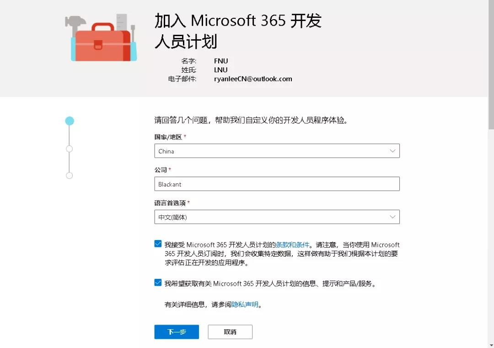

   - 新页面中，勾选“个人项目”，下一步，全选，保存。

     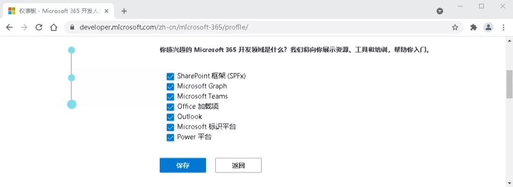

   - 关闭弹窗，点击“设置E5订阅”

     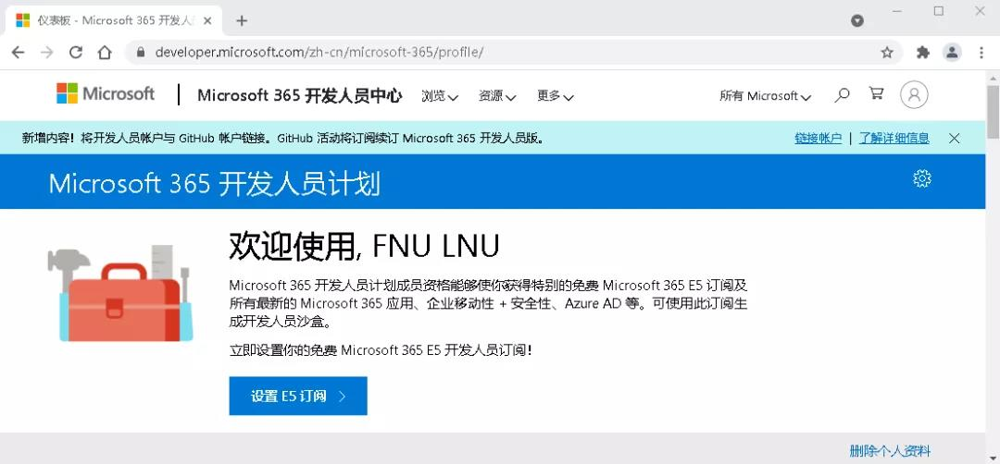

   - 在订阅设置界面中，输入用户名和域（用户名+域+固定后缀=你的域名，比如：用户名为lee，域为cn，加上固定后缀.onmicrosoft.com，就形成你的域名：lee@cn.onmicrosoft.com），这里其实就是管理中心登陆账号，也就是全局管理员，所以务必根据提示输入信息，手机号务必正确，用来接收验证码（由于网站使用了谷歌人机验证，因此需要科学上网）。

     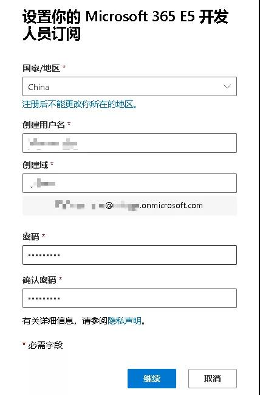

   - 等待一分钟左右，页面将显示订阅成功（剩余92天，25位用户许可证）。

     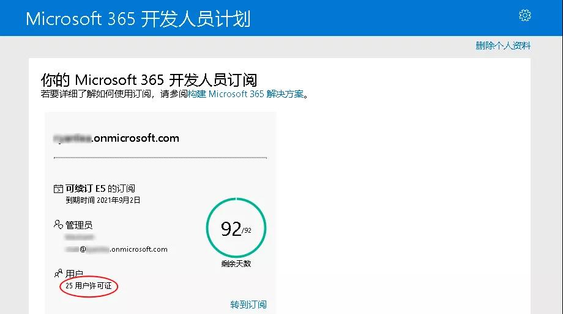

3. #### 下载安装Office 365:

   打开 Office官网（https://www.office.com） ，使用上图中的管理员账号和密码登录，关闭引导后，点击左边栏的PPT或者 Word 等图标，即可使用网页端服务（需要等系统自动设置好OneDrive才可以）。如需使用客户端，点击右上角的“安装Office ”->“Office 365 应用”，使用下载的安装器，跟随步骤安装即可。

4. #### 扩展空间：

   订阅号默认的 OneDrive 空间是 1T，可在管理页扩展为 5T。打开 OneDrive 存储管理页（https://logi.im/go/aHR0cHM6Ly9hZG1pbi5vbmVkcml2ZS5jb20vP3Y9U3RvcmFnZVNldHRpbmdz） ，登录申请的管理号，将默认存储空间1024修改为5012后点击保存。如页面无法加载，则系统尚未完成初始化，等待 24 小时后重新打开。

   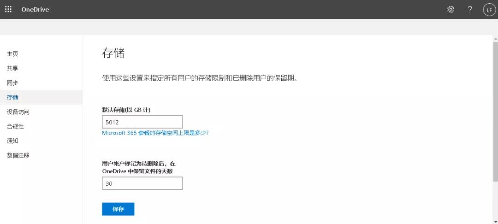

5. #### 子号分配：

6. - 管理员可分配 25 个子号，每个子号都可使Office 365 并拥有 5T OneDrive 空间。点击页面中的 “管理” 按钮，进入管理员中心。

     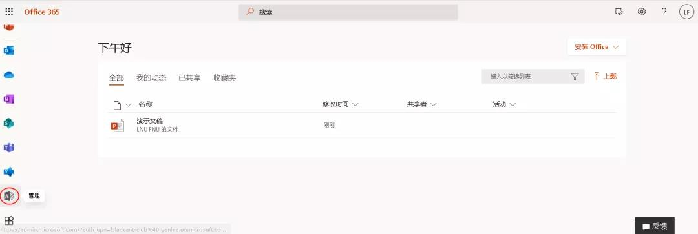

   - 点击左侧菜单栏的“用户 - 活跃用户”，点击右侧的“添加用户”

     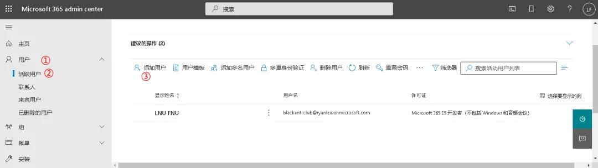

   - 在弹出的选项卡中，填写必要信息后，点击“下一步”。

     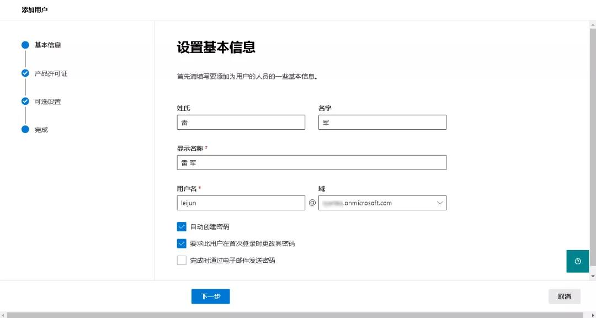

   - 在接下来的三个步骤中，全部“保持默认选项”，直接点击“下一步”，最后“添加关闭”选项卡即可。

7. #### 实现E 5自动续期：

   Microsoft 365 E5 Renew Plus是由CSDN博主SundayRX开发的一款专门用于E5自动续期的Windows桌面工具，它通过自动调用API的方式加强开发者账户的活跃度，以此来自动续期E5。

   5.1 用管理员账号登录Azure应用注册（https://portal.azure.com/#blade/Microsoft_AAD_RegisteredApps/ApplicationsListBlade），点击左上角的“新注册”

   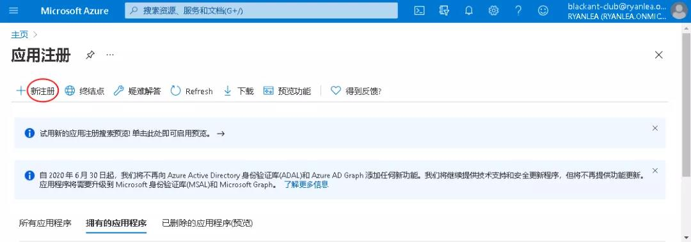

   5.2 名称随意写、注意可访问性选项选择第三项、重定向URL暂时不填 、完成后点击注册。

   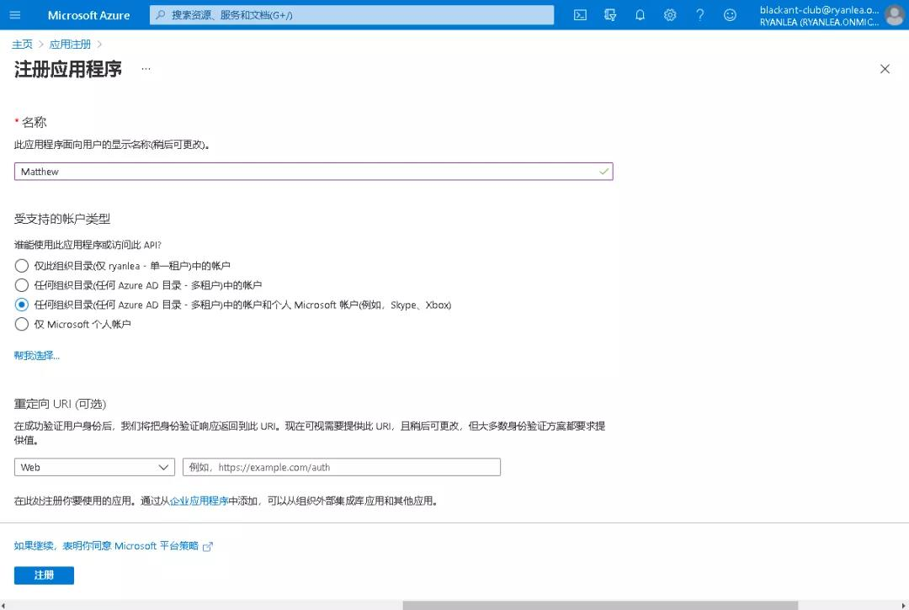

   5.3 新页面中选择左边栏的“概述”，点击右边栏的“添加重定向URL”

   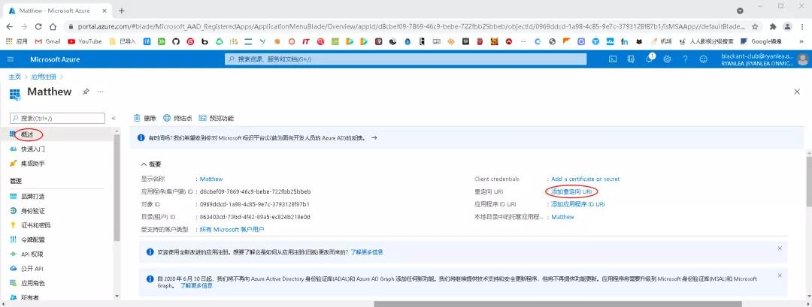

   5.4 点击“添加平台”，再点击“移动和桌面应用程序”

   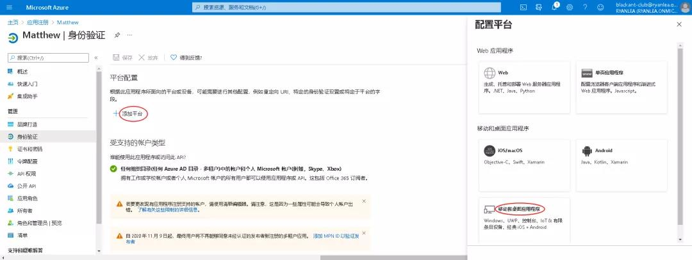

   5.5 勾选中第一个URL，将“允许公共客户端流”，默认按钮“否”切换为“是” ，点击“配置”，点击“保存”。

   5.6 点击左边栏的证书和密码->新客户端密码->按序号操作如图：

   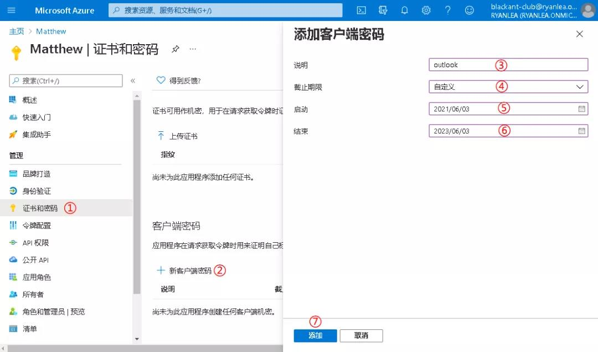

   5.7 最后保存好客户端密码备用：

   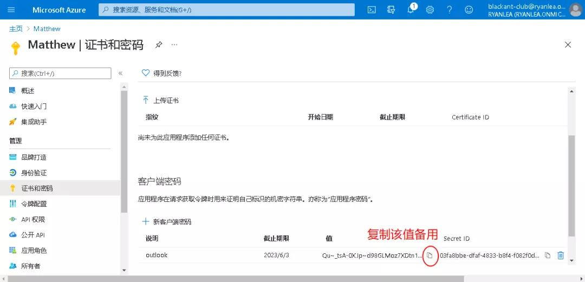

   5.8 点击左边栏的概述，复制右边栏的客户端ID备用：

   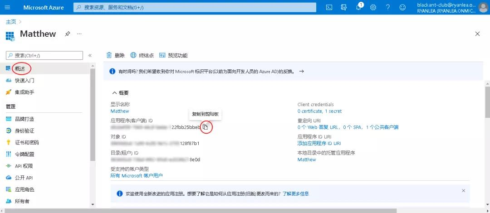

   5.9 到这里有两种解决方法：

8. - 方法一：使用程序自动请求配置API权限：软件无需安装但需要安装运行环境支持。

     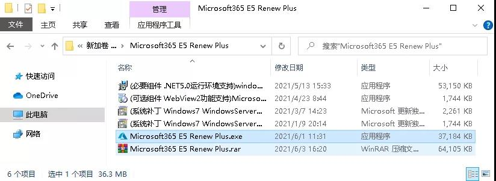

   - 运行程序，点击“开始运行”，点击右边栏的“添加账号”，账号栏填注册的管理员账号，客户端ID可到上面的第5.8步中查看并复制，然后点击“自动配置应用程序API权限”

     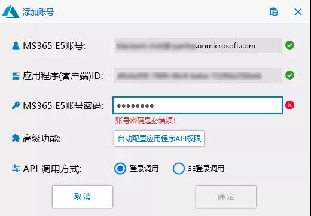

   - 弹窗，登录管理员账号并输入密码，勾选“代表组织同意”，点击“接受”，回到软件界面，此时会显示“授权成功”，点击“确定”

   - 点击开始运行即可。

     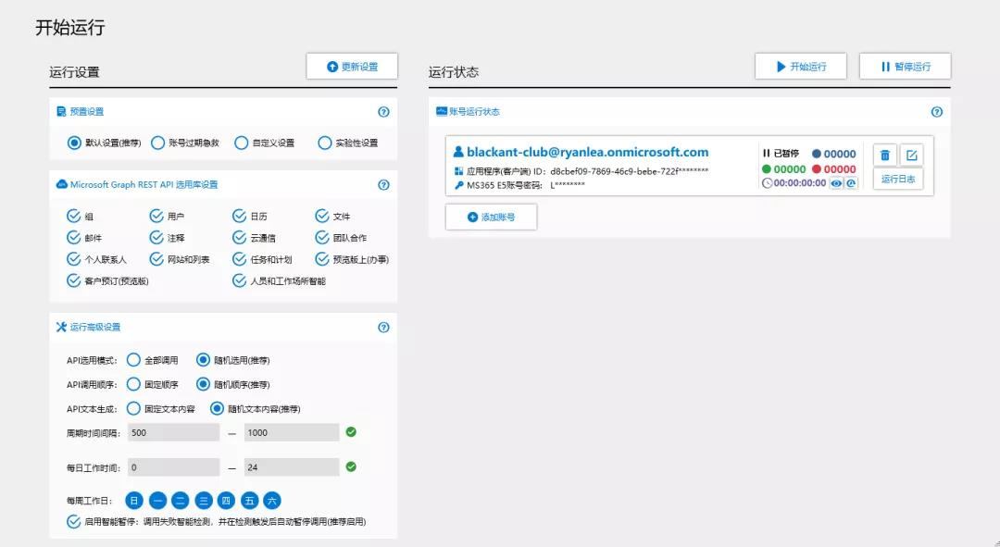

   - 方法二：订阅的有效期是90天。到期前，如果微软检测到账号被用于开发，即API被频繁且无规律调用，将自动续期。因此，只需编写几行代码，定时高频调用其API即可。

   - 打开Azure应用注册，点击左边栏的身份验证->右边栏的添加URL->在输入框中输入 https://e5.qyi.io/outlook/auth2/receive ，然后点击保存。

     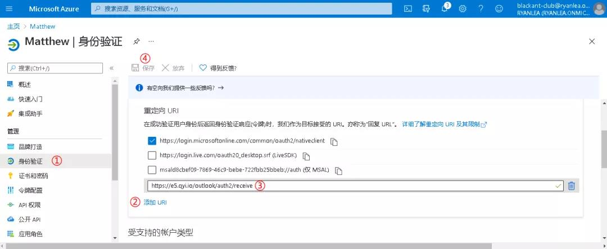

   - 注册个Github 账号，小黑在博客上已做介绍，这里不再赘述。打开下面的网址 https://e5.qyi.io ，点击登录（用注册的Github 账号），点击授权luoye663->返回个人中心->新建->名称随便输入（如：Matthew），描述可空->确定

     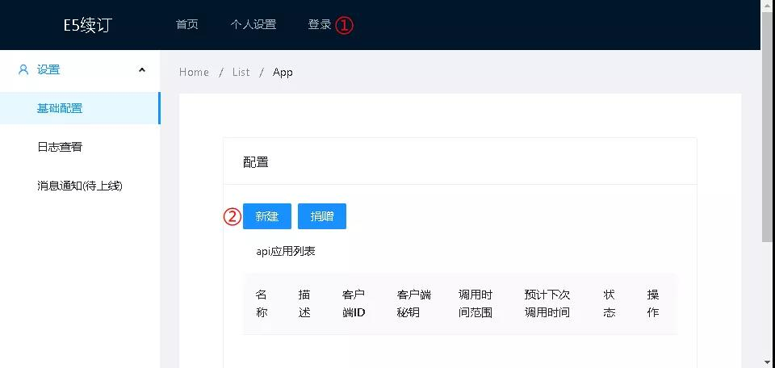

   - 点击配置

     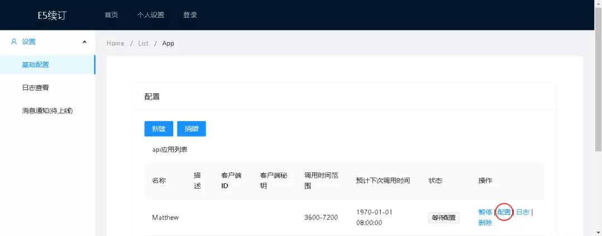

   - 弹窗，输入客户端ID和客户端密码（上面第5.8和5.7步，当时提示备用），点击下一步

     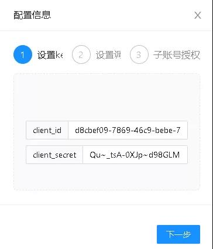

   - 接着点下一步，点击去授权，此时会跳转到 microsoftonline Auth2.0授权页面，这里建议使用同一个域下的空账号(子账号)进行授权。(苹果手机需要在App Store中下载Authenticayor用来扫码)

     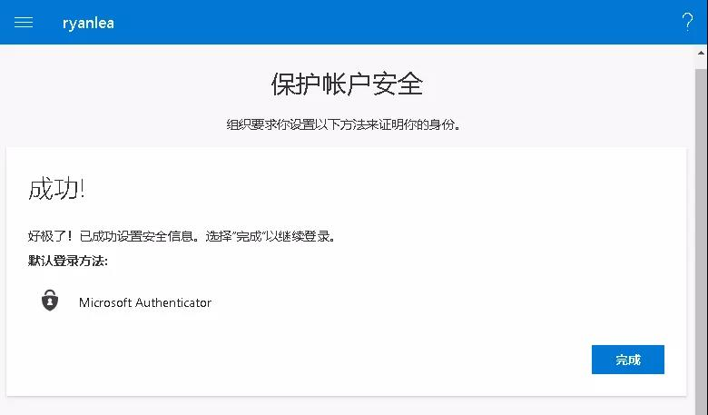

   - 打开Office官网，测试刚创建的子号是否可以登录和使用：

     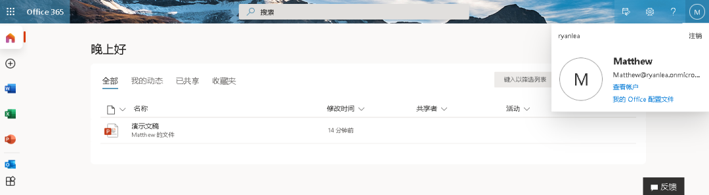