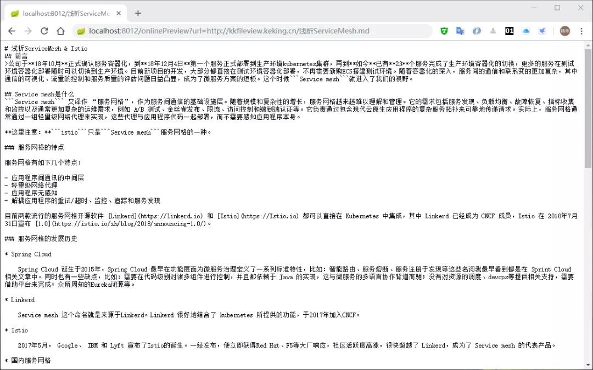
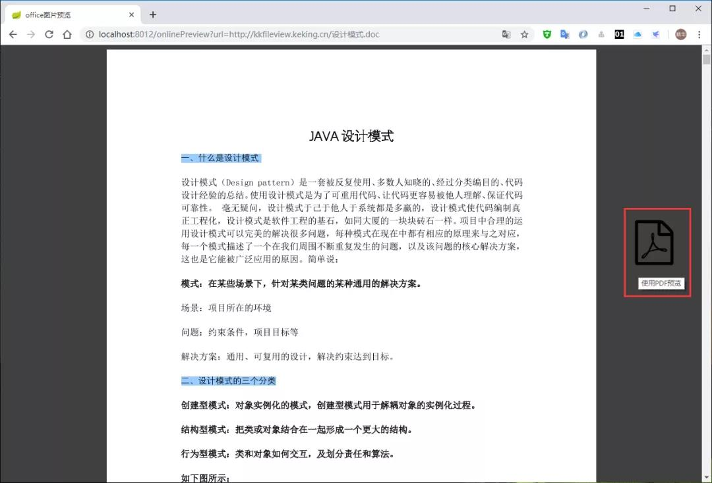
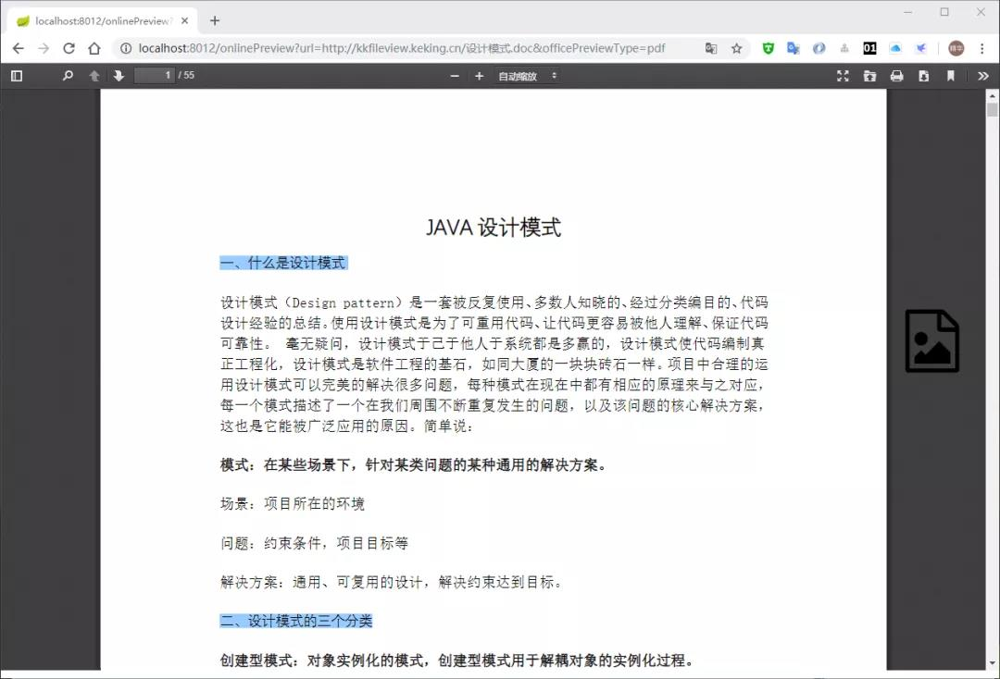
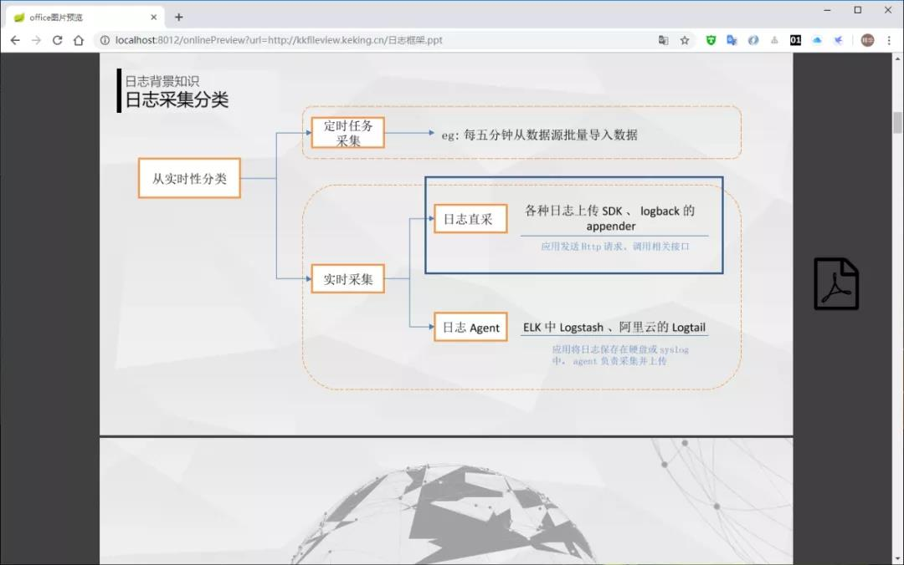
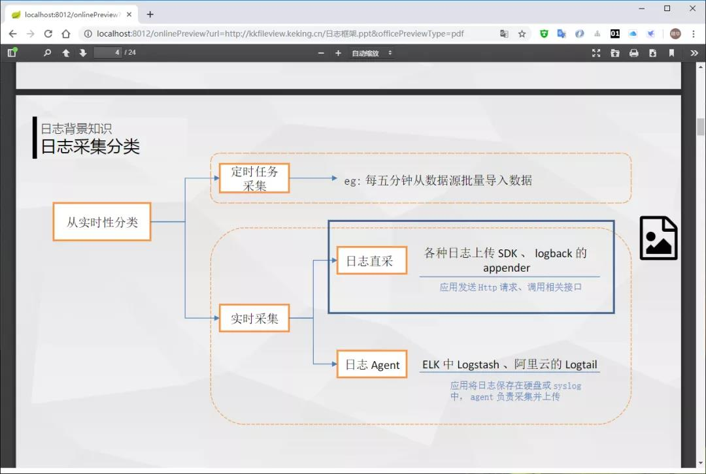
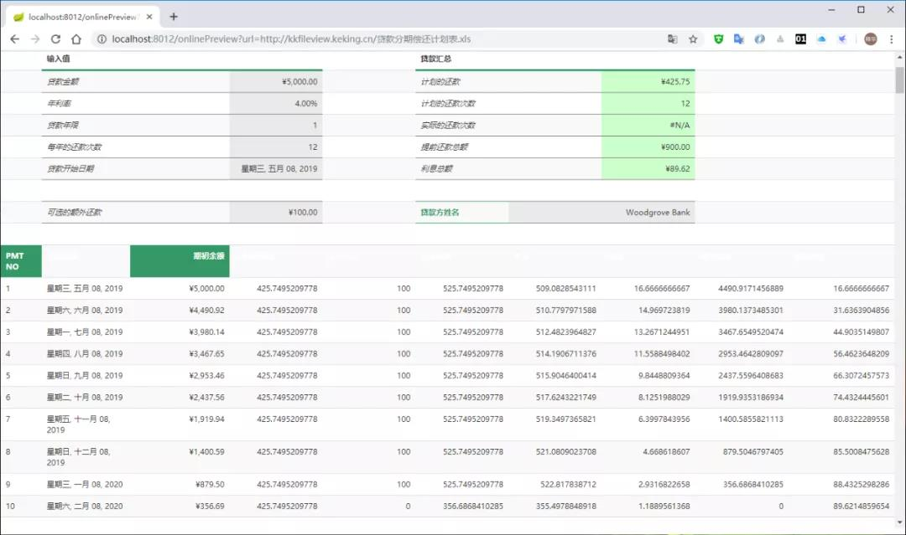

# 推荐一个文件文档在线预览系统，号称Github超强

> 收藏时间：2021/06/11 12:38:00
>
> 收藏地址 ：https://mp.weixin.qq.com/s/PPMobDCS36dzxsCam68JVw

今天，猿妹要和大家分享一个文件文档在线预览项目，对标业内付费产品有【永中office】【office365】【idocv】等，这个项目号称是Github最强文件在线预览系统——kkFileView。

kkFileView具有以下功能特性：

- 支持word excel ppt，pdf等办公文档
- 支持txt,java,php,py,md,js,css等所有纯文本
- 支持zip,rar,jar,tar,gzip等压缩包
- 支持jpg，jpeg，png，gif等图片预览（翻转，缩放，镜像）
- 支持mp3，mp4，flv等多媒体文件预览
- 使用spring boot开发，预览服务搭建部署非常简便
- rest接口提供服务，跨平台特性(java,php,python,go,php，....)都支持，应用接入简单方便
- 支持普通http/https文件下载url、http/https文件下载流url、ftp下载url等多种预览源
- 提供zip，tar.gz发行包，提供一键启动脚本和丰富的配置项，方便部署使用
- 提供Docker镜像发行包，方便在容器环境部署
- 抽象预览服务接口，方便二次开发，非常方便添加其他类型文件预览支持
- Apache协议开源，代码pull下来想干嘛就干嘛

​	

**预览展示**

**文本预览**

支持所有类型的文本文档预览， 由于文本文档类型过多，无法全部枚举，文本预览效果如下：

**word文档预览**

支持doc，docx文档预览，word预览有两种模式：一种是每页word转为图片预览，另一种是整个word文档转成pdf，再预览pdf。两种模式的适用场景如下：

**图片预览：**word文件大，前台加载整个pdf过慢

**pdf预览：**内网访问，加载pdf快

**ppt文档预览**

支持ppt，pptx文档预览，和word文档一样，有两种预览模式

图片预览模式预览效果如下：

pdf预览模式预览效果如下

**excel文档预览**

支持xls，xlsx文档预览，预览效果如下

创建者有建立一个相当详细的项目文档，文档写的特别的到位，基本所有内容都覆盖到了：

最后附上项目地址：https://github.com/kekingcn/kkFileView

